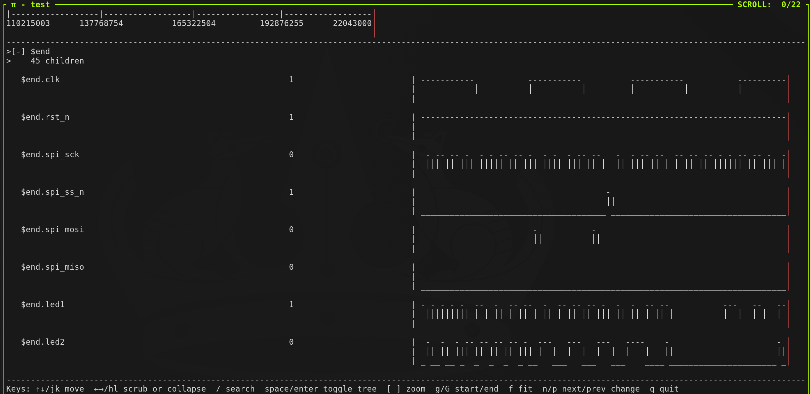

# Pi Agent VCD Waveform Viewer Package

## Overview

A VCD/FST ASCII waveform viewer implemented as an extension of the [Pi Coding Agent](https://pi.dev/)
Minimally tested and featured. Inspired by [Hardcaml's Waveterm](https://ocaml.org/p/hardcaml_waveterm/v0.15.0/doc/hardcaml_waveterm/Hardcaml_waveterm/Waveform/index.html)

## Why use a slop, vibe-coded AI Agent extension to view VCDs when perfectly good viewers already exist? Does that really make sense?

No. I wanted to see how extensible the Pi Coding Agent really is. And the UX can't get much worse than Modelsim, so maybe this is an improvement.
It's just a fun terminal feature.
